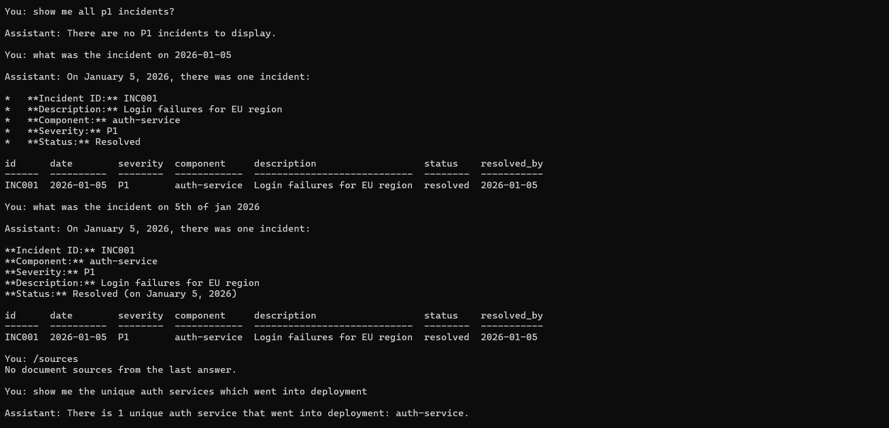

# operations-data-docs-chatbot
Python chatbot for natural-language querying over CSV data and technical documentation using SQLite, ChromaDB, and Gemini.

# Operations Data & Documentation Chatbot

A Python-based chatbot for natural-language queries over **structured datasets (CSV)** and **technical documentation (PDF/TXT)**.  
It combines data processing, prompt design, retrieval, and structured output generation in a single local workflow.

---

## Overview

This chatbot can answer two kinds of questions:

- **Structured data questions** from CSV files
- **Documentation questions** from PDF and TXT files

It routes each question to the correct processing path, retrieves the relevant information, and generates a clean natural-language answer.

---

## How It Works

```text
Your question
      │
   router.py        ← classifies: data / docs / both / general
    ↙      ↘
data_agent  doc_retriever    ← fetch relevant info
    ↘      ↙
  generator.py      ← format structured answer
      │
   Output

```
---

## Documentation pipeline
1. PDF and TXT documents are chunked into smaller sections 
2. Chunks are embedded and stored in ChromaDB 
3. Relevant chunks are retrieved using similarity search 
4. Gemini answers using the retrieved context 

---
## Features
1. Natural-language querying over CSV data
2. Semantic search over PDF and TXT documentation
3. Automatic routing between data and document queries
4. SQLite-backed structured data querying
5. ChromaDB-based document retrieval
6. Structured answer generation
7. Simple command-line chat interface
8. Commands for debugging and inspection

---

## Project Structure

```text
ops_chatbot/
├── app.py              # entry point, chat loop
├── config.py           # settings (models, paths, chunk sizes)
├── data_loader.py      # CSV → SQLite
├── doc_ingest.py       # PDF/TXT → ChromaDB
├── doc_retriever.py    # vector similarity search
├── router.py           # classifies each question
├── data_agent.py       # NL → SQL → natural language answer
├── generator.py        # structured JSON output for doc answers
├── requirements.txt
├── .env
├── data/               # put CSV files here
│   ├── incidents.csv
│   └── deployments.csv
└── docs/               # put PDF/TXT files here

```

---


## Tech Stack

- **Python**
- **SQLite** for structured data querying
- **ChromaDB** for vector storage and retrieval
- **Gemini API** for question understanding and answer generation
- **PDF/TXT ingestion pipeline** for document indexing

---

## Setup

1. **Get a Gemini API key**  
   Go to Google AI Studio, create an API key, and copy it.

2. **Create a `.env` file**  
   Add your API key:
   ```env
   GEMINI_API_KEY=your_api_key_here
   ```
3. **Install dependencies**
    ```env
      python3 -m pip install -r requirements.txt

   ```

4. **Run the app**
   ```env
      python3 app.py

   ```

---


## Example Queries
**Structured data queries**
```env
      How many open incidents are there?
Show me all P1 incidents
Which service had the most incidents?
Who has done the most deployments?
Were there any rollbacks?
  ```
---

## Commands

| Command | What it does |
|---|---|
| `/help` | Show all commands |
| `/sql` | Show the SQL query from the last data answer |
| `/sources` | Show which document was used in the last answer |
| `/reset` | Clear conversation history |
| `/quit` | Exit the chatbot |

---


## Troubleshooting

| Error | Fix |
|---|---|
| `GEMINI_API_KEY not set` | Check that your `.env` file contains the real API key |
| `ModuleNotFoundError` | Run `python3 -m pip install -r requirements.txt` |
| `No module named 'google'` | Run `python3 -m pip install google-generativeai` |
| `ChromaDB errors` | Delete the `chroma_db/` folder and restart |


---

## Screenshots
Terminal-based chatbot handling incident lookups, date-based queries, and deployment-related questions over structured operational data.



---

